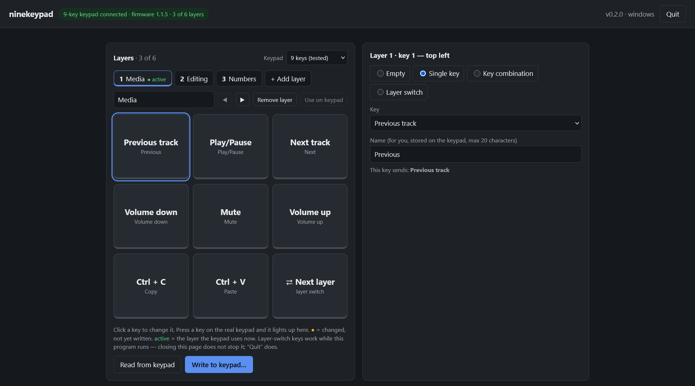

# ninekeypad

**A free, portable programmer for Vaydeer macro keypads, for Windows and Linux.**
One small file per system, no installer, no account, no internet.

Change what each key of your Vaydeer keypad sends: single keys, key combinations, media
keys, up to 6 layers, and keys that switch between the layers. You do it on a simple page in
your own browser, and the program checks every write.

**[⬇ Download the latest version](https://github.com/maxaimax/ninekeypad/releases/latest)** ·
[Tested hardware](#tested-hardware) · [Quick start](#quick-start) · [How the keypad talks](docs/protocol.md)

> Not connected to or endorsed by Vaydeer. Tested with the Vaydeer **9-key** keypad on
> **Windows 11** and **Ubuntu 26.04.1**. The 4-key keypad is supported but not tested yet.



## Features

- **Every key, your choice:** a single key, a key combination (e.g. `Ctrl`+`Shift`+`F`), a
  media key, or nothing. Letters, digits, F1–F12, number pad, navigation and editing keys,
  and media keys (play/pause, stop, next, previous, volume, mute).
- **Up to 6 layers**, each with its own name. "Use on keypad" makes any layer the active one.
- **Layer-switch keys:** set a key to "Next layer", "Previous layer" or "Go to layer N".
  While the program runs, pressing it switches the keypad's layer. (The keypad cannot switch
  layers by itself; this is what Vaydeer's own software does too.)
- **See it live:** press a key on the keypad and it lights up on the page.
- **Safe writing:** before every write, the whole keypad is saved as a backup in `backups/`.
  After writing, every layer and key is read back and compared. The firmware-update command is
  blocked in the code, so this program can never change the keypad's firmware.
- **Layouts:** save as many layouts as you like in `layouts/`, load, rename and delete them.
  The factory layout (7 8 9 / 4 5 6 / 1 2 3) is built in.
- **Portable:** one file (about 7.5 MB, pure Go, no runtime). It installs nothing, needs no
  driver, and writes only into its own folder, so it also runs from a USB stick.
- **Private:** the page is served only on this computer (`127.0.0.1`), protected by a secret
  key in its address. The program sends nothing to the internet.
- **Your browser:** the program prints the page's address; it never opens a browser itself.

## Tested hardware

**Only the 9-key keypad was tested.** It was tested on two systems:

| | Tested keypad |
|---|---|
| Keypad | Vaydeer 9-key "Smart Keypad", 3 × 3 keys |
| Model | JP-1011 (the start of its USB serial number) |
| USB ID | `0483:5752`, USB product name "9-key Smart Keypad" |
| Chip | Not inspected (the keypad was not opened). The USB vendor ID `0483` belongs to STMicroelectronics, which suggests an STM32 microcontroller; one other report says ESP32. |
| Firmware | 1.1.5, bootloader 0.2.2 (the program shows both) |
| Layers | up to 6 |
| Keys | numbered 1–9 on the page, left to right, top to bottom |
| USB interfaces | 0: commands (vendor-defined, 64-byte reports) · 1: keyboard · 2: key events (vendor-defined) · 3: mouse, media and system keys |

| System | Version | Tested |
|---|---|---|
| Windows | Windows 11 Pro 25H2 (build 26200), x64 | reading all keys and layers; writing 1 and 2 layers with the read-back check; key presses shown live; switching the active layer; layer-switch keys; single keys and Shift combinations typing in a real application |
| Linux | Ubuntu 26.04.1 LTS (kernel 7.0), x64, GNOME on Wayland, Firefox; started from a live USB stick | finding and reading the keypad; the page; key presses shown live; switching the active layer; writing with the read-back check; `--keepalive`; files stay owned by the user although the program runs with `sudo` |

Not yet seen on Linux: the program's second try when the keypad does not answer its first
question (added after the first Linux test showed that problem).

**Untested:**

- **The 4-key keypad** (Vaydeer "One-Handed Macro Keyboard, 4 keys", model JP3071-C). Other
  projects report the same protocol and USB ID, and the keypad reports its own key count. The
  program supports it, numbers its keys 1 to 4 (their physical arrangement is not known here),
  and warns on the page that it is untested.
- Other Linux systems than Ubuntu 26.04.1, and computers other than x64 (only x64 programs
  are built).
- Other Vaydeer keypads (1 or 6 keys, knobs) and other firmware versions. Keypads with other
  key counts are refused, not guessed.

**Have a 4-key keypad, another firmware or another system?** Please
[open an issue](https://github.com/maxaimax/ninekeypad/issues) with the output of
`ninekeypad --list` and `ninekeypad --read` (on Linux with `sudo`). Both only read.

## Quick start

### Windows

1. Download `ninekeypad-…-windows-x64.zip` from
   [Releases](https://github.com/maxaimax/ninekeypad/releases/latest) and unzip it anywhere,
   e.g. to a USB stick.
2. Start `ninekeypad.exe`. The program is not signed, so Windows may say "Windows protected
   your PC": click **More info**, then **Run anyway**.
3. Press **Enter** in its window to copy the page's address, and paste it into your browser.
   You can bookmark it: the address stays the same.

### Linux

```sh
tar -xzf ninekeypad-*-linux-x64.tar.gz
cd ninekeypad-linux
sudo ./ninekeypad
```

`sudo` is needed because Linux lets only the administrator talk to USB devices directly (the
program installs no system rules). To copy the address, select it with the mouse and use
right-click > Copy: in a terminal, **Ctrl+C stops the program**.

On Linux the tested keypad types nothing until a program reads its key presses. While
ninekeypad runs, it does that; without the page, `sudo ./ninekeypad --keepalive` keeps the
keys working.

### On the page

Click a key, choose what it sends, and press **Write to keypad**. More in the README.txt next to
each program ([Windows](docs/README-windows.txt), [Linux](docs/README-linux.txt)).

### Command line

| Option | What it does |
|---|---|
| *(none)* | starts the page |
| `--list` | lists the keypad's USB interfaces (for troubleshooting) |
| `--read` | prints the keypad's layers as JSON |
| `--keepalive` | Linux: keeps the keys working without the page, until Ctrl+C |
| `--port N` | uses port N for the page this time |
| `--dir FOLDER` | keeps layouts and backups in FOLDER instead of the program's folder |

## No warranty

The program writes to the keypad's memory. It makes a backup first and checks every write, but
use it at your own risk. Keys made with the Vaydeer app that hold text, macros, mouse actions or
program launches are shown but cannot be written by this program, so its backups cannot restore
those; only the Vaydeer app can.

## How it works

The program talks to the keypad over USB HID with only what the system offers: `hid.dll` on
Windows, `/dev/hidraw` on Linux. It needs no driver and no library. It runs a small web
server on `127.0.0.1`, and the page in your browser talks to it. Everything known about the
keypad's protocol, and which facts were seen on the real keypad, is in
[docs/protocol.md](docs/protocol.md).

## Build from source

Needs Go 1.22 or newer. The scripts use a project-local Go in `.tools/go`:

```powershell
scripts\build.ps1
```

This runs the tests and builds `dist\ninekeypad-windows\ninekeypad.exe` and
`dist\ninekeypad-linux\ninekeypad`, each with its README.txt and LICENSE.txt. Both are pure Go
(no cgo); the Linux program is built on Windows.

Run Go only through `scripts\go.ps1` (e.g. `scripts\go.ps1 test ./...`): it keeps Go's cache,
temp files and settings inside `.tools\`, so building writes nothing outside the project.

**Setting up `.tools/go`:** download the Windows amd64 zip from <https://go.dev/dl/>, check its
SHA-256 against the page, unzip it so `.tools\go\bin\go.exe` exists, then run
`scripts\go.ps1 telemetry off`.

`scripts/pre-commit` (turned on with `git config core.hooksPath scripts`) refuses a commit that
contains an e-mail address, a personal folder path, or the git author's name or e-mail.

| Path | What |
|---|---|
| `cmd/ninekeypad` | the program: options, clipboard, clean stop |
| `internal/hid` | USB HID with only the system: hid.dll/cfgmgr32 (Windows), sysfs + `/dev/hidraw` (Linux) |
| `internal/vaydeer` | the keypad protocol; see [docs/protocol.md](docs/protocol.md) |
| `internal/vaydeer/vaydeertest` | a simulated keypad for the tests |
| `internal/layout` | layouts, backups, presets, file storage |
| `internal/app` | the local web server (127.0.0.1 + secret key) and the page (`web/index.html`) |

## Thanks

The keypad's protocol was learned from these projects (facts only; no code was copied):

- [callum-baillie/vaydeer-studio-linux](https://github.com/callum-baillie/vaydeer-studio-linux)
- [alex-savin/go-vaydeer-ninepad-hid](https://github.com/alex-savin/go-vaydeer-ninepad-hid)
- [philipp-fischer/vaydeer-macro-keyboard](https://github.com/philipp-fischer/vaydeer-macro-keyboard)
- [primis.org: Vaydeer 9 Key Linux Fix](https://primis.org/blog/post/2024-06-17/Vaydeer-9-Key-Linux-Fix)

## License

[CC0 1.0](LICENSE): public domain. Use, change and share it for anything, no permission needed.

"Vaydeer" is a trademark of its owner; it is used here only to say which keypads this program
works with.
